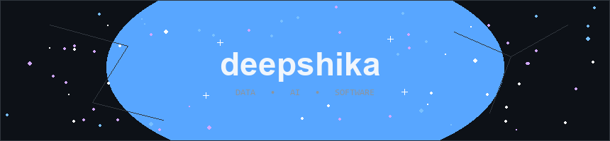

<!-- ══════════════ COSMIC ANIMATED SPACE HERO ══════════════ -->

 

<!-- ══════════════ TYPING TAGLINES ══════════════ -->

<picture>
  <source media="(prefers-color-scheme: dark)"
    srcset="https://readme-typing-svg.demolab.com?font=Fira+Mono&size=13&duration=2600&pause=1200&color=777777&center=true&vCenter=true&width=620&height=22&lines=making+data+reason+and+software+decide.;building+intelligent+systems+from+scratch.;ai+%2F+data+science+%2F+software+engineering;learning%2C+building%2C+breaking%2C+rebuilding.">
  
</picture>

  

<!-- ══════════════ MATCHED 50/50 TWO-COLUMN PANELS ══════════════ -->

<table width="100%" cellpadding="0" cellspacing="0" border="0" style="max-width: 860px; border: none; border-collapse: separate; border-spacing: 16px 0;">
<tr>
<td width="50%" valign="top" style="border: 1px solid #30363d; border-radius: 8px; background-color: #0d1117; padding: 18px 20px;">

 

<b>FOCUS & BACKGROUND</b> 

I'm a final-year B.Tech Computer Science student with a minor in Data Science, interested in building practical systems where software, data, and AI come together. My work spans data analysis, machine learning, backend development, and AI-powered applications, with a focus on turning technical ideas into useful solutions.

 

<b>CORE PRINCIPLE</b> 

I enjoy taking data from raw information to meaningful insight, then turning those insights into software that people can actually use. I value clean engineering, continuous learning, and building systems that are both functional and purposeful.

</td>

<td width="50%" valign="top" style="border: 1px solid #30363d; border-radius: 8px; background-color: #0d1117; padding: 18px 20px;">

 

<b>WHAT I'M EXPLORING</b> 

I'm currently strengthening my DSA and problem-solving foundations while deepening my understanding of machine learning, data analytics, and backend engineering. I'm particularly interested in AI-powered applications, document intelligence, RAG pipelines, semantic search, and the connection between intelligent models and real software systems.

 

<b>WHAT I'M BUILDING</b> 

I'm applying these interests through projects involving PDF intelligence, predictive analytics, fundraising data, and interactive dashboards. My current stack brings together Python, SQL, machine learning, FastAPI, React, and data visualization to build complete, data-driven applications.

</td>
</tr>
</table>

  

<!-- ══════════════ TECH STACK ══════════════ -->

  

<table border="0" cellspacing="0" cellpadding="6">
<tr>
<td align="center" width="115">
<b>LANGUAGES</b> 

</td>
<td width="1" bgcolor="#21262d"></td>
<td align="center" width="115">
<b>BACKEND</b> 

</td>
<td width="1" bgcolor="#21262d"></td>
<td align="center" width="115">
<b>FRONTEND</b> 

</td>
<td width="1" bgcolor="#21262d"></td>
<td align="center" width="115">
<b>TOOLS</b> 

</td>
</tr>
</table>

 

&nbsp;
&nbsp;
&nbsp;
&nbsp;
&nbsp;
&nbsp;
&nbsp;

 

<!-- ══════════════ CONTRIBUTION SNAKE ══════════════ -->

  

<picture>
  <source media="(prefers-color-scheme: dark)"
    srcset="https://raw.githubusercontent.com/deepshika1211/deepshika1211/output/github-contribution-grid-snake-dark.svg">
  <source media="(prefers-color-scheme: light)"
    srcset="https://raw.githubusercontent.com/deepshika1211/deepshika1211/output/github-contribution-grid-snake.svg">
  
</picture>

  

<!-- ══════════════ CONNECT ══════════════ -->

&nbsp;

&nbsp;

 

<!-- ══════════════ FOOTER BANNER ══════════════ -->

